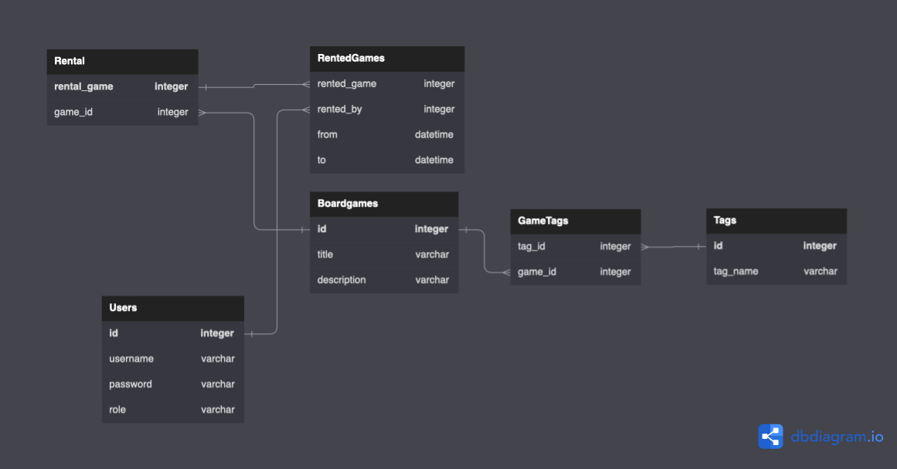

# PZ2_Project

This repository contains the source code for the simple board-games rental system. 

## Table of Contents

1. [Project Structure](#project-structure)
2. [Usage](#usage)
3. [Database](#database)
4. [Contribution](#contribution)

## Project Structure

The project consists of several main directories and files:

- `Controllers`: Contains the logic related to receiving requests, handling them, and responding back to the user. The HomeController.cs file is the main logic class in project, responsible mostly of handling logging, registering, and browsing data.
- `Data`: Holds the database and related components of the project database. It contains games data and tags.
- `Models`: Stores the classes that represent the data in the application. They manage rental, tagging and browsing data.
- `Views`: Contains the user interfaces of the application. 


## Usage

This section will vary depending on the permissions given to the user. Because of that this section will be divided into two subsections regarding casual user and administrative user.
### User
User has access to limited features. 
- After registering and logging in he is allowed to browse games data using the `"Browse games"` site. The browsing feature is extended by filtering games by tags and searching by game names. The tagging system is controlled by administrative accounts.  
- Apart from that, users can rent games by the `"Rental Service"`. It is a site where you can pick a game from the rental pool and mark it as reserved for a chosen period of time.
### Administrator
Administrative accounts has acces to the same features as users, but also: 
- In `"Rental Service"` they are able to reserve games for chosen periods of time as well as cancel reservations made by users and other adnimistrative accounts.
- The `"Rental Service"` is also a way to add more games to the rental pool. 
- They have access to `"Tagger Tool"` where they can add tags to specific games to make it more convinient while browsing. On `"Browse games"` they can remove chosen tags from database.
- Administrators can also use the `"Database Editor"` where they can directly alter tables (Users, Boardgames, Tags, GameTags, Rental, RentedGames) in database.
- There can be added add other administrative accounts to the database, by adding record to the Users table (in the `"Database Editor"`) and selecting the accounts role as admin. As this is destignated way of creating administrative accounts, the password provided in the record will be automatically hashed and secured by MD5Hash algorithm.


## Database
This application uses a relational SQLite database with the following tables:

- `Users`: This table holds the data related to the users of the application. Each record includes an id (which serves as the primary key), username, password, and role fields.

- `Boardgames`: This table stores information about the board games available in the application. Each record consists of an id (which serves as the primary key), title (which is unique to each game), and description fields.

- `Tags`: The Tags table is used to categorize the board games. Each tag record has an id (serving as the primary key) and a unique tag_name.

- `GameTags`: This table is a junction table that creates a many-to-many relationship between the Boardgames and Tags tables. It includes tag_id and game_id fields which are foreign keys referencing Tags(id) and Boardgames(id) respectively.

- `Rental`: This table holds information about game rentals. Each rental record has a rental_game (which serves as the primary key) and a game_id (a foreign key referencing Boardgames(id)).

- `RentedGames`: This table stores the data about which games have been rented by which users and for what duration. Each record includes rented_game (a foreign key referencing Rental(rental_game)), rented_by (a foreign key referencing Users(id)), and rented_from and rented_to fields which represent the duration of the rental.

This database structure allows for efficient storage and retrieval of user, game, tag, and rental information, as well as relationships between these entities.


```
CREATE TABLE `Users` (id INTEGER PRIMARY KEY, username TEXT, password TEXT, role TEXT); 
CREATE TABLE `Boardgames` (id INTEGER PRIMARY KEY, title TEXT UNIQUE, description TEXT); 
CREATE TABLE `Tags` (id INTEGER PRIMARY KEY,tag_name TEXT UNIQUE); 
CREATE TABLE `GameTags` (tag_id INTEGER, game_id INTEGER, FOREIGN KEY (tag_id) REFERENCES Tags(id), FOREIGN KEY (game_id) REFERENCES Boardgames(id)); 
CREATE TABLE `Rental` (rental_game INTEGER PRIMARY KEY, game_id INTEGER, FOREIGN KEY (game_id) REFERENCES Boardgames(id)); 
CREATE TABLE `RentedGames` (rented_game INTEGER, rented_by INTEGER, rented_from DATETIME, rented_to DATETIME, FOREIGN KEY (rented_game) REFERENCES Rental(rental_game), FOREIGN KEY (rented_by) REFERENCES Users(id)); 
```

## Contribution
Project was made by Konrad Reczko and Joanna Wójcicka for Programowanie Zaawansowane 2.
